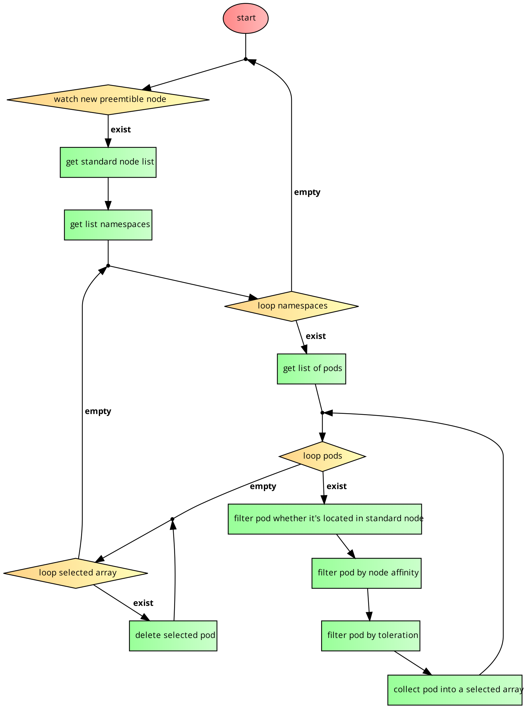

# Magneto Helm Chart

Magneto is a kubernetes controller to move pods to a particular GKE preemptible node.  

It will watch whether there is any new GKE preemtible node assign to new cluster and delete any eligible podd on standard node so that they can be rescheduled to preemtible node.

> This is an initial release and not considered stable. Use at your own risk.

## Flow Diagram



## Installing the Chart

To install the chart with the release name `my-release`:

```bash
$ helm repo add kitabisa https://kitabisa.github.io/charts-public/
$ helm install my-release kitabisa/magneto
```

The command deploys Pandemi on the Kubernetes cluster in the default configuration.

## Uninstalling the Chart
To uninstall/delete the my-release deployment:

```shell
$ helm uninstall my-release
```
The command removes all the Kubernetes components associated with the chart and deletes the release.

## Parameters
| Name                           | Default Value        | Description                                                                                                            |
| ------------------------------ | -------------------- | ---------------------------------------------------------------------------------------------------------------------- |
| configmap.logLevel             | `error`              | Log level (debug/info/warn/error/fatal)                                                                                |
| configmap.nodeReadyWaitTime    | `10s`                | Wait time after node ready before assigning pod to node. Use golang suffix unit https://pkg.go.dev/time#ParseDuration  |
| configmap.podDeletionInterval  | `3s`                 | Delay interval between pod deletion. Use golang suffix unit https://pkg.go.dev/time#ParseDuration                      |
| configmap.preemptibleLabel     | `{}`                 | Key-value pair collection of preemtible node label                                                                     |
| configmap.standardLabel        | `{}`                 | Key-value pair collection of standard node label                                                                       |
| configmap.preemtibleTaint      | `{}`                 | Key-value pair collection of preemtible node taint                                                                     |
| image.name                     | `kitabisa/magneto`   | Image repo/name                                                                                                        |
| image.tag                      | `0.0.1`              | Image tag                                                                                                              |
| image.pullPolicy               | `IfNotPresent`       | Pull policy                                                                                                            |
